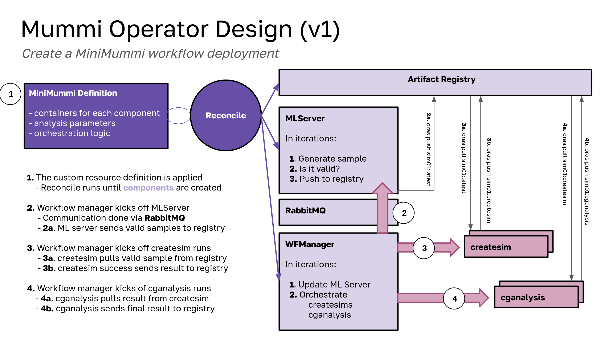

# mummi-operator

> Hello! I'm the mini mummi! 🦛



The Mummi Operator is intended to run MiniMummi. 

## Usage

### Prerequisites

- go version v1.22.0+
- docker version 17.03+.
- kubectl version v1.11.3+.
- Access to a Kubernetes v1.11.3+ cluster.

### 1. Create Cluster

You can create a cluster locally (if your computer is chonky and can handle it) or use AWS. Here is locally:

```bash
kind create cluster --config ./examples/kind-config.yaml
```

And for AWS (recommended for most cases):

```bash
eksctl create cluster --config-file examples/eks-config-6.yaml
aws eks update-kubeconfig --region us-east-2 --name mini-mummi

# hpc6a cpu instances
# cpu createsim container pull: 70-80 seconds
#                      runtime: 21-?24 minutes
# cpu cganalysis          pull: 93 seconds
# cganalysis
# debug issue with rabbitmq disconnecting
# add max cganalysis check, should send request back to operator to terminate everything but the registry.
eksctl create cluster --config-file examples/eks-config-hpc6a.yaml
aws eks update-kubeconfig --region us-east-2 --name mini-mummi

# Or with GPUs
eksctl create cluster --config-file examples/eks-config-gpu-6.yaml
aws eks update-kubeconfig --region us-east-1 --name mini-mummi-gpu
```

## 2. Load Images

> Kind Only

If you are using kind, you will want to load your images. If you are using AWS (and on our account with the registry) then you'll be able to pull them to the cluster. Note that we are going to load the images to make our lives easier (otherwise we need to include them with pull secrets). You might need to login and pull these first:

```bash
aws ecr get-login-password --region us-east-1 | docker login --username AWS --password-stdin 633731392008.dkr.ecr.us-east-1.amazonaws.com
docker pull 633731392008.dkr.ecr.us-east-1.amazonaws.com/mini-mummi:rabbitmq
docker pull 633731392008.dkr.ecr.us-east-1.amazonaws.com/mini-mummi:mlserver
docker pull 633731392008.dkr.ecr.us-east-1.amazonaws.com/mini-mummi:wfmanager
docker pull 633731392008.dkr.ecr.us-east-1.amazonaws.com/mini-mummi:createsims
docker pull 633731392008.dkr.ecr.us-east-1.amazonaws.com/mini-mummi:cganalysis
```

And then load from your local machine. When we run this on EKS, we will likely have easy access to our private registry.

```bash
kind load docker-image 633731392008.dkr.ecr.us-east-1.amazonaws.com/mini-mummi:rabbitmq
kind load docker-image 633731392008.dkr.ecr.us-east-1.amazonaws.com/mini-mummi:mlserver
kind load docker-image 633731392008.dkr.ecr.us-east-1.amazonaws.com/mini-mummi:wfmanager
kind load docker-image 633731392008.dkr.ecr.us-east-1.amazonaws.com/mini-mummi:createsims
kind load docker-image 633731392008.dkr.ecr.us-east-1.amazonaws.com/mini-mummi:cganalysis
```

## 3. Install the Operator

The operator is built via its manifest in dist. For development:

```bash
make test-deploy-recreate
```

For non-development:

```bash
kubectl apply -f examples/dist/mummi-operator.yaml
```

## 4. Deploy an Example Mini Mummi

### a. Without GPU


```bash
# Without GPU
kubectl apply -f examples/test-aws/mummi.yaml
```

### b. With GPU

Test that you see the GPU devices:

```bash
kubectl get nodes -o json | grep nvidia.com/gpu

# More specific
kubectl get nodes -o json | jq -r .items[].status.capacity | grep nvidia
```

### c. GPU Operator

If you are unfortunate enough to need to use this:

```bash
kubectl create ns gpu-operator
kubectl label --overwrite ns gpu-operator pod-security.kubernetes.io/enforce=privileged

helm repo add nvidia https://helm.ngc.nvidia.com/nvidia
helm repo update
helm install --wait --generate-name -n gpu-operator --create-namespace nvidia/gpu-operator --version=v24.9.1 --set driver.enabled=false

# Check labels and GPUs (you should see nvidia.com/gpu)
kubectl get pods -n gpu-operator
kubectl get nodes -o json | jq '.items[].metadata.labels'
kubectl apply -f examples/test-aws/gpu-mummi.yaml
```

Here is how to get the charts installed to the namespace and uninstall:

```bash
# Show the name generated in the gpu-operator namesapce
helm list -n gpu-operator

# Uninstall the chart
helm uninstall -n gpu-operator gpu-operator-1736103287
```

Note that if the workflow manager isn't connecting, it's some race condition:

```console
[retry=1/100] No RPC server is listening on queue mummi_queue_mummiusr, retrying in 5 secondes ...
```

You should be able to delete the pod and it will be recreated.

```bash
kubectl delete pod  mummi-sample-wfmanager-64d87ddb87-6w8lb
```

If you want to delete the deployment, and note that jobs are not tied to the Mummi Operator (intentionally) so you can delete them separately:

```bash
kubectl delete -f examples/test-aws/mummi.yaml

# Or for GPU
kubectl delete -f examples/test-aws/gpu-mummi.yaml
kubectl delete jobs --all
```

That is done so if the workflow manager or mlserver (or another component) needs to be nuked, we won't lose running jobs.

## 5. Cleanup

```bash
eksctl delete cluster --config-file examples/eks-config-6.yaml --wait
eksctl delete cluster --config-file examples/eks-config-gpu-6.yaml --wait
```


## Design

These are some design decisions I've made (of course open to discussion):

### Initial Design

 - State is derived from Kubernetes, and not relying on some filesystem state
 - We assume jobs don't need to be paused / resumed / reclaimed like on HPC
 - Internal: all of the controller logic, etc. should be internal
 - I'm trying to add kubernetes functionality in a way that doesn't disturb (change) core mummi. E.g., entrypoints and environment variables.
 - If/when the operator is deleted, jobs (createsim and cganalysis) are not. I think this might make sense if the orchestration needs update without destroying the jobs.
   - But the job state can be re-discovered by a newly deployed operator
 - Variables and functions to derive customization for Mummi should all derive from the spec (e.g., so the many templates can be populate just using it)
 - Instead of all assets for a deployment in one config map or secret, I am separating them out. This will allow more pointed update (if needed) and more transparency to the developer user.

### Refactored Design

Note that this design was further refactored into the [state machine operator](https://github.com/converged-computing/state-machine operator). This model uses a state machine, and there is no mummi logic (or code) required for the workflow manager. Each mummi job step is just a modular container for the state machine to use.

## Debugging

### RabbitMQ

You can shell into the rabbitmq pod to test the connection:

```console
root@rabbitmq:/# openssl s_client -connect rabbitmq.mummi-sample.default.svc.cluster.local:5671 -servername rabbitmq.mummi-sample.default.svc.cluster.local
Connecting to 10.244.0.7
CONNECTED(00000003)
write:errno=104
---
no peer certificate available
---
No client certificate CA names sent
---
SSL handshake has read 0 bytes and written 355 bytes
Verification: OK
---
New, (NONE), Cipher is (NONE)
This TLS version forbids renegotiation.
Compression: NONE
Expansion: NONE
No ALPN negotiated
Early data was not sent
Verify return code: 0 (ok)
---
```

## License

HPCIC DevTools is distributed under the terms of the MIT license.
All new contributions must be made under this license.

See [LICENSE](https://github.com/converged-computing/cloud-select/blob/main/LICENSE),
[COPYRIGHT](https://github.com/converged-computing/cloud-select/blob/main/COPYRIGHT), and
[NOTICE](https://github.com/converged-computing/cloud-select/blob/main/NOTICE) for details.

SPDX-License-Identifier: (MIT)

LLNL-CODE- 842614
